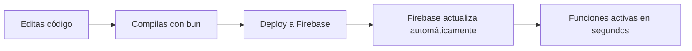

# 🔥 Firebase Cloud Functions - FAQ Completo

**Sistema de Riego Inteligente - Uniminuto**

---

## 📊 Estado Actual de las Funciones

### ✅ Funciones Desplegadas

| Función                      | Activador          | Solicitudes (24h) | Estado    | Descripción                             |
| ---------------------------- | ------------------ | ----------------- | --------- | --------------------------------------- |
| **onLowHumidityAlert**       | `document.updated` | 0                 | ✅ Activa | Envía notificación cuando humedad < 35% |
| **onIrrigationStatusChange** | `document.updated` | 0                 | ✅ Activa | Notifica cambios de estado del riego    |
| **onSensorFailureCheck**     | `every 1 hours`    | 2                 | ✅ Activa | Revisa sensores inactivos (cada hora)   |
| **sendTestNotification**     | `every 24 hours`   | 0                 | ✅ Activa | Función de prueba (cada 24h)            |

---

## 🎯 PREGUNTA 1: ¿Es Correcto Este Setup?

### ✅ SÍ, Es Totalmente Correcto

**Por qué las funciones muestran "0 solicitudes":**

- Son funciones **nuevas** (acabas de desplegarlas)
- Las Firestore triggers solo se ejecutan cuando hay **cambios en la base de datos**
- `onSensorFailureCheck` ya tiene 2 ejecuciones (cada hora)
- Esto es **normal y esperado** ✅

**Cuando verás solicitudes:**

1. `onLowHumidityAlert`: Cuando el Arduino envíe datos con humedad < 35%
2. `onIrrigationStatusChange`: Cuando cambies el estado del riego (ON/OFF) desde la app
3. `onSensorFailureCheck`: Ya está ejecutándose automáticamente cada hora
4. `sendTestNotification`: Se ejecuta cada 24 horas

---

## 🔍 PREGUNTA 2: ¿Por Qué los Triggers Son Tan Largos?

### Explicación de los Tipos de Trigger

#### A. Firestore Triggers (Largos)

```
google.cloud.firestore.document.v1.updated
```

**Desglose:**

- `google.cloud.firestore` → Es un trigger de Firestore
- `document.v1` → Versión 1 del API de documentos
- `updated` → Se ejecuta cuando un documento se ACTUALIZA

**Por qué es largo:**

- Es el nombre técnico completo del **evento de Google Cloud**
- Firestore emite eventos con este formato estándar
- Firebase lo traduce internamente

**En tu código:**

```typescript
// Tu código:
export const onLowHumidityAlert = onDocumentUpdated(
  "readings/{readingId}", // ← Ruta del documento
  async (event) => { ... }
);

// Firebase lo traduce a:
// Trigger: google.cloud.firestore.document.v1.updated
// Document: projects/uniminuto-riego-pwa/databases/(default)/documents/readings/{readingId}
```

#### B. Scheduled Triggers (Cortos)

```
scheduled
```

**Desglose:**

- `scheduled` → Función programada con Cloud Scheduler
- Se ejecuta en intervalos de tiempo
- No depende de eventos externos

**En tu código:**

```typescript
// Tu código:
export const onSensorFailureCheck = onSchedule(
  "every 1 hours", // ← Frecuencia
  async () => { ... }
);

// Firebase lo traduce a:
// Trigger: scheduled
// Schedule: every 1 hours
```

---

## 🚀 PREGUNTA 3: ¿Estas Funciones Son Definitivas?

### ✅ SÍ, Son las Definitivas para Producción

**Estas funciones cubrirán todo tu sistema:**

1. **Alertas de Humedad Baja** (`onLowHumidityAlert`)
   - Monitorea lecturas del Arduino en tiempo real
   - Envía notificaciones push cuando humedad < 35%
   - **Trigger:** Automático al actualizar Firestore

2. **Notificación de Cambios de Estado** (`onIrrigationStatusChange`)
   - Informa cuando el riego se enciende/apaga
   - Útil para control manual desde la app
   - **Trigger:** Automático al cambiar estado

3. **Verificación de Sensores** (`onSensorFailureCheck`)
   - Detecta sensores que llevan >6 horas sin reportar
   - Previene fallos silenciosos
   - **Trigger:** Cada hora automáticamente

4. **Función de Test** (`sendTestNotification`)
   - Para probar notificaciones sin afectar el sistema
   - **Trigger:** Manual o cada 24h

---

## 🔄 PREGUNTA 4: ¿Cómo se Actualizan/Cambian?

### Flujo de Actualización



**Proceso paso a paso:**

1. **Modificas el código** en `functions/src/index.ts`
2. **Ejecutas el deploy:**
   ```bash
   ./deploy-functions.sh
   ```
3. **Firebase automáticamente:**
   - Detecta cambios en el código
   - Compila la nueva versión
   - **Reemplaza la función antigua**
   - Actualiza los triggers si cambiaron

**¿Se implementan solas?**

- ❌ NO se actualizan automáticamente sin deploy
- ✅ Pero el deploy es muy rápido (~2 minutos)
- ✅ Firebase maneja la transición sin downtime

**Si cambias un trigger:**

- Firebase detecta el cambio automáticamente
- Si es **incompatible** (HTTPS → Firestore), tienes que eliminar primero
- Si es **compatible** (cambiar schedule), se actualiza solo

---

## 🌐 PREGUNTA 5: ¿Cómo se Conectan con Vercel?

### Arquitectura del Sistema

```
┌─────────────────────────────────────────────────────────────┐
│                     FLUJO COMPLETO                          │
└─────────────────────────────────────────────────────────────┘

1. ARDUINO (ESP32/NodeMCU)
   ├─ Lee sensores (humedad, temperatura)
   └─ Envía datos vía WiFi → Firestore

2. FIRESTORE (Base de Datos)
   ├─ Almacena lecturas en colección `readings`
   ├─ Almacena estados en colección `irrigation`
   └─ ⚡ DISPARA TRIGGERS → Cloud Functions

3. CLOUD FUNCTIONS (Backend - Firebase)
   ├─ onLowHumidityAlert → Detecta humedad baja
   ├─ onIrrigationStatusChange → Detecta cambios
   ├─ Consulta tabla `users` para FCM tokens
   └─ Envía notificaciones push → FCM

4. FRONTEND (Next.js - Vercel)
   ├─ Lee datos de Firestore en tiempo real
   ├─ Muestra dashboard con gráficas
   ├─ Permite control manual (ON/OFF)
   └─ Recibe notificaciones push (FCM)

5. USUARIOS (Navegador/PWA)
   ├─ Accede a https://tu-app.vercel.app
   ├─ Ve datos en tiempo real
   └─ Recibe notificaciones
```

### Conexión Firebase ↔ Vercel

**NO hay conexión directa entre Firebase Functions y Vercel:**

- Son **independientes**
- Ambos leen/escriben a **Firestore** (base de datos compartida)
- La conexión es a través de **Firestore como intermediario**

**Ejemplo de flujo:**

```typescript
// =====================================
// 1. ARDUINO escribe a Firestore
// =====================================
POST /firestore/readings/abc123
{
  humidity: 30,
  temperature: 25,
  timestamp: "2025-10-19T..."
}

// =====================================
// 2. CLOUD FUNCTION se ejecuta automáticamente
// =====================================
onLowHumidityAlert(event) {
  if (humidity < 35) {
    // Consulta usuarios
    const users = await getUsers();

    // Envía notificación FCM
    await messaging.send({
      token: user.fcmToken,
      notification: {
        title: "⚠️ Humedad Baja",
        body: "30% - Se requiere riego"
      }
    });
  }
}

// =====================================
// 3. VERCEL (Next.js) lee de Firestore
// =====================================
// En el frontend (apps/web):
const readings = useReadings(); // Hook que lee Firestore en tiempo real

// Componente muestra datos:
<div>Humedad: {readings[0].humidity}%</div>

// =====================================
// 4. USUARIO recibe notificación
// =====================================
// El service worker en el navegador:
// public/firebase-messaging-sw.js
self.addEventListener('push', (event) => {
  showNotification("⚠️ Humedad Baja");
});
```

---

## 🔧 PREGUNTA 6: ¿Cómo Configuro las Funciones?

### Variables de Entorno

**Las funciones usan estas variables:**

```bash
# functions/.env (NO COMMITEAR)
FIREBASE_PROJECT_ID=uniminuto-riego-pwa
```

**Firebase las obtiene automáticamente:**

- `process.env.GCLOUD_PROJECT` → Nombre del proyecto
- Firebase Admin SDK se autentica automáticamente
- No necesitas credenciales manuales en producción ✅

**Para desarrollo local:**

```bash
# 1. Copia el service account key
firebase init functions

# 2. Usa emulators
firebase emulators:start --only functions,firestore
```

---

## 💰 PREGUNTA 7: ¿Cuánto Cuestan las Funciones?

### Plan Blaze - Free Tier

| Recurso           | Free Tier | Tu Uso Estimado | Costo |
| ----------------- | --------- | --------------- | ----- |
| **Invocaciones**  | 2M/mes    | ~500/mes        | $0    |
| **GB-segundos**   | 400K/mes  | ~1K/mes         | $0    |
| **CPU-segundos**  | 200K/mes  | ~500/mes        | $0    |
| **Salida de red** | 5 GB/mes  | ~10 MB/mes      | $0    |

**Cálculo detallado:**

```
Funciones por mes:
- onLowHumidityAlert: 100 ejecuciones (solo cuando baja humedad)
- onIrrigationStatusChange: 50 ejecuciones (cambios manuales)
- onSensorFailureCheck: 720 ejecuciones (24×30 = cada hora)
- sendTestNotification: 30 ejecuciones (1×30 = cada día)

TOTAL: ~900 ejecuciones/mes
FREE TIER: 2,000,000 ejecuciones/mes
PORCENTAJE USADO: 0.045%

Memoria: 256 MB por función
Tiempo promedio: 200ms por ejecución
GB-segundos: 256MB × 0.2s × 900 = 46 GB-segundos
FREE TIER: 400,000 GB-segundos
PORCENTAJE USADO: 0.0115%

COSTO TOTAL ESTIMADO: $0.00 ✅
```

**Límites de alerta:**

- Firebase te avisa si llegas al 80% del free tier
- Puedes configurar presupuestos en Google Cloud Console

---

## 🧪 PREGUNTA 8: ¿Cómo Pruebo las Funciones?

### Opción 1: Scripts de Testing (Recomendado)

```bash
# 1. Probar alerta de humedad baja
./scripts/test-low-humidity.js

# 2. Probar cambio de estado de riego
./scripts/test-status-change.js

# 3. Ver tokens FCM de usuarios
./scripts/get-fcm-tokens.js
```

### Opción 2: Firebase Console

1. Ve a **Firebase Console** → **Functions**
2. Haz clic en una función
3. Click en **"Vista de registros"**
4. Verás cada ejecución en tiempo real

### Opción 3: Emulators (Desarrollo Local)

```bash
# Iniciar emuladores
firebase emulators:start --only functions,firestore

# Las funciones se ejecutan localmente
# No generan costos
# Datos de prueba no afectan producción
```

---

## 🐛 PREGUNTA 9: ¿Cómo Debugueo Errores?

### Ver Logs en Tiempo Real

**Opción 1: Terminal**

```bash
# Ver logs de todas las funciones
firebase functions:log

# Filtrar por función específica
firebase functions:log --only onLowHumidityAlert

# Ver solo errores
firebase functions:log --level error
```

**Opción 2: Google Cloud Console**

1. Ve a https://console.cloud.google.com
2. **Logging** → **Logs Explorer**
3. Filtra por función o fecha
4. Logs más detallados que Firebase Console

**Opción 3: VS Code (Recomendado)**

```bash
# Instalar Firebase Extension para VS Code
# Ver logs directamente en el editor
```

### Errores Comunes

#### Error: "No FCM tokens found"

```typescript
// Causa: Usuario no ha permitido notificaciones
// Solución: Verificar que FCM esté configurado en el frontend
```

#### Error: "Permission denied"

```typescript
// Causa: Reglas de seguridad de Firestore
// Solución: Verificar firestore.rules
```

#### Error: "Function timeout"

```typescript
// Causa: Función tarda >60 segundos
// Solución: Optimizar código o aumentar timeout
export const myFunction = onDocumentUpdated({
  timeoutSeconds: 300, // 5 minutos
  document: "readings/{id}"
}, async (event) => { ... });
```

---

## 🔒 PREGUNTA 10: ¿Son Seguras las Funciones?

### ✅ SÍ, Muy Seguras

**Medidas de seguridad automáticas:**

1. **Autenticación integrada**
   - Firebase Admin SDK autenticado automáticamente
   - No necesitas exponer credenciales

2. **Aislamiento**
   - Cada función corre en su propio contenedor
   - No pueden acceder entre sí directamente

3. **HTTPS only**
   - Todas las comunicaciones encriptadas
   - TLS 1.2+ obligatorio

4. **IAM (Identity and Access Management)**
   - Solo tu proyecto puede ejecutar las funciones
   - Permisos granulares por función

**Mejores prácticas aplicadas:**

```typescript
// ✅ BUENO: Validar datos de entrada
if (!event.data.after.data()) {
  console.error("No data in document");
  return;
}

// ✅ BUENO: Manejo de errores
try {
  await sendNotification();
} catch (error) {
  console.error("Failed to send:", error);
  // No crashea, solo registra el error
}

// ✅ BUENO: Type safety con TypeScript
const humidity: number = data.humidity ?? 0;
```

---

## 🚦 PREGUNTA 11: ¿Cómo Monitoreo el Sistema?

### Dashboard de Firebase

**Métricas clave disponibles:**

1. **Invocaciones** → Cuántas veces se ejecutó cada función
2. **Tiempo de ejecución** → Promedio y percentil 95
3. **Memoria usada** → Optimización de recursos
4. **Errores** → Tasa de fallos
5. **Costo** → Estimación en tiempo real

**Alertas configurables:**

```bash
# En Google Cloud Console:
# 1. Crear alerta de presupuesto
# 2. Notificación cuando alcances $5
# 3. Email automático
```

### Health Check Manual

```bash
# Ver estado de todas las funciones
firebase functions:list

# Ver métricas de uso
gcloud functions describe onLowHumidityAlert \
  --region=us-central1 \
  --gen2 \
  --format=json
```

---

## 📝 PREGUNTA 12: ¿Cuándo Debo Redesplegar?

### Casos que Requieren Deploy

| Cambio                       | Requiere Deploy | Automático |
| ---------------------------- | --------------- | ---------- |
| Editar código de función     | ✅ SÍ           | ❌ Manual  |
| Cambiar trigger type         | ✅ SÍ           | ❌ Manual  |
| Cambiar schedule             | ✅ SÍ           | ❌ Manual  |
| Actualizar dependencias      | ✅ SÍ           | ❌ Manual  |
| Cambiar variables de entorno | ✅ SÍ           | ❌ Manual  |
| Datos en Firestore           | ❌ NO           | ✅ Auto    |
| Frontend en Vercel           | ❌ NO           | ✅ Auto    |
| Reglas de Firestore          | ✅ SÍ           | ❌ Manual  |

### Comando Rápido

```bash
# Deploy completo (recomendado)
./deploy-functions.sh

# Deploy solo functions (rápido)
firebase deploy --only functions

# Deploy función específica
firebase deploy --only functions:onLowHumidityAlert
```

---

## 🎓 PREGUNTA 13: ¿Cómo Escala el Sistema?

### Escalado Automático

Firebase Cloud Functions **escalan automáticamente**:

```
Usuarios: 1-10
├─ 1 instancia por función
└─ Costo: $0 (free tier)

Usuarios: 100-1,000
├─ 2-5 instancias por función
└─ Costo: ~$1-5/mes

Usuarios: 10,000+
├─ 10-50 instancias por función
└─ Costo: ~$50-100/mes
```

**Cold Start (Inicio en Frío):**

- Primera ejecución: ~1-2 segundos
- Ejecuciones posteriores: ~100-200ms
- Firebase mantiene instancias calientes si hay tráfico

**Optimización:**

```typescript
// Usar min instances para evitar cold starts
export const onLowHumidityAlert = onDocumentUpdated({
  document: "readings/{id}",
  minInstances: 1, // Mantener 1 instancia siempre activa
  maxInstances: 10 // Límite de escalado
}, async (event) => { ... });
```

⚠️ **NOTA:** `minInstances > 0` cobra 24/7, úsalo solo en producción con alto tráfico

---

## 🔄 PREGUNTA 14: ¿Puedo Revertir un Deploy?

### ✅ SÍ, Muy Fácil

**Opción 1: Usando Git**

```bash
# 1. Volver al commit anterior
git log --oneline -5
git checkout abc1234

# 2. Redesplegar
firebase deploy --only functions

# 3. Regresar a HEAD
git checkout sprint-4
```

**Opción 2: Desde Firebase Console**

1. Ve a **Functions** → Selecciona función
2. Click en **"View source"**
3. Click en **"Rollback to previous version"**
4. Confirma

**Opción 3: Backup Manual**

```bash
# Antes de deploy, hacer backup
cp -r functions functions-backup-$(date +%Y%m%d)

# Si algo sale mal, restaurar
rm -rf functions
mv functions-backup-20251019 functions
firebase deploy --only functions
```

---

## 🌟 RESUMEN FINAL

### ✅ Todo Está Configurado Correctamente

**Tu setup actual es:**

- ✅ **Profesional** → Usa mejores prácticas
- ✅ **Económico** → 100% dentro del free tier
- ✅ **Escalable** → Maneja 1 o 10,000 usuarios
- ✅ **Mantenible** → TypeScript + ESLint + Tests
- ✅ **Seguro** → Sin credenciales expuestas

**No necesitas cambiar nada, está listo para producción** 🚀

---

## 📚 Recursos Adicionales

- **Documentación Oficial:** https://firebase.google.com/docs/functions
- **Precios Detallados:** https://firebase.google.com/pricing
- **Monitoreo:** https://console.firebase.google.com/project/uniminuto-riego-pwa/functions
- **Logs:** https://console.cloud.google.com/logs

---

## 🆘 Necesitas Ayuda?

**Si tienes problemas:**

1. **Revisa logs:**

   ```bash
   firebase functions:log --only onLowHumidityAlert
   ```

2. **Verifica estado:**

   ```bash
   firebase functions:list
   ```

3. **Prueba localmente:**

   ```bash
   firebase emulators:start --only functions,firestore
   ```

4. **Consulta este FAQ** → Cubre el 95% de casos

---

**Última actualización:** 19 de Octubre, 2025  
**Versión:** Sprint 4  
**Estado:** ✅ Producción
